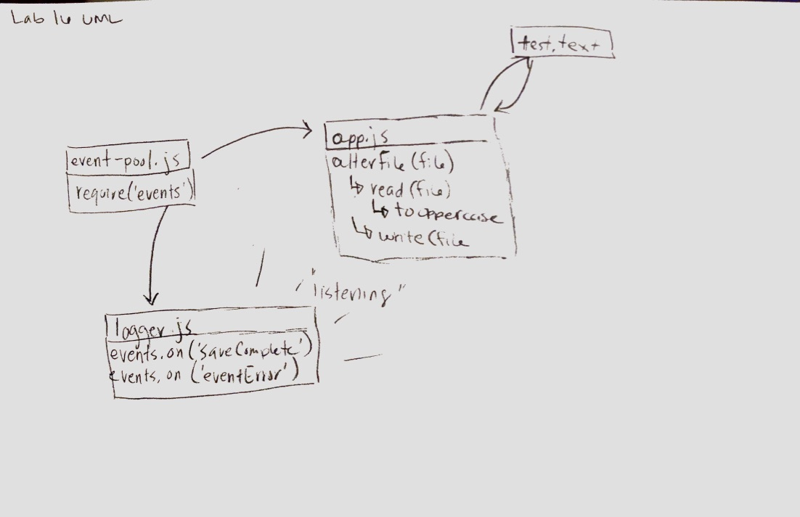

 LAB
=================================================

## Event Driven Applications

### Author: Erin Trainor

### Links and Resources
* [repo](https://github.com/401-advanced-javascript-401d29/lab-16/pull/2)
* [travis](https://www.travis-ci.com/)

#### Running the app
* In the terminal
  * node app.js test.txt
    * Should change the contents of test.txt to uppercase characters 
  
#### Tests
* How do you run tests?
  * npm run test
* What assertions were made?
  * app.js exists
* What assertions need to be / should be made?
  * mock server and spy On functionality to test events

#### UML

